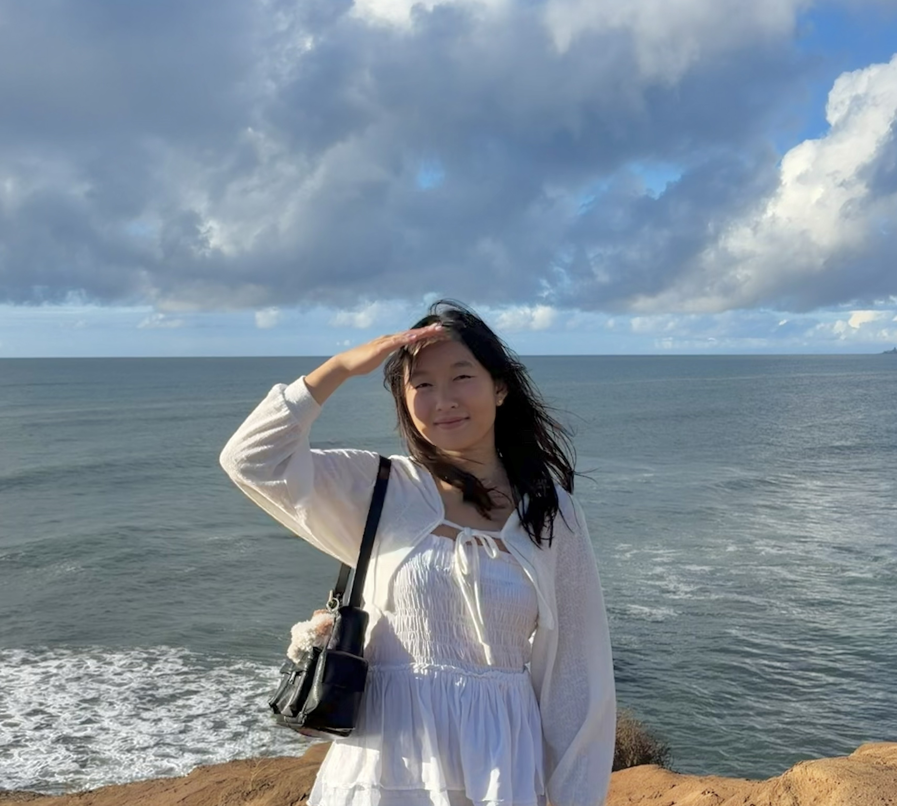

# About Me

Hi, nice to meet you! I'm Jenny, a junior studying computer science at UC San Diego.

> "Success isn't linear"

[View My Photo](imgs/Me.jpg)

Check out my profile:  
[GitHub Profile](https://github.com/jenniferrzhu)

See What I've Been Up To:  
[Life Lately](lately.md)

*Fun Fact*: My favorite programming language is `System.out.println("Java")`.

```java
public class HelloWorld {
    public static void main(String[] args) {
        System.out.println("Hello World");
    }
}
```

**Learn more about me:**
[Career Interests](#career-interests)  
[Hobbies](#hobbies)  
[Tasks: 2026 Goals](#tasks-2026-goals)

## Career Interests

1. Mobile App Development
2. Full-Stack Development

## Hobbies

- Trying new foods/cafes
- Snowboarding
- Hiking

## Tasks: 2026 Goals

- [x] Visit La Jolla Seals
- [ ] Travel Outside the Country
- [ ] Read 5 Books
